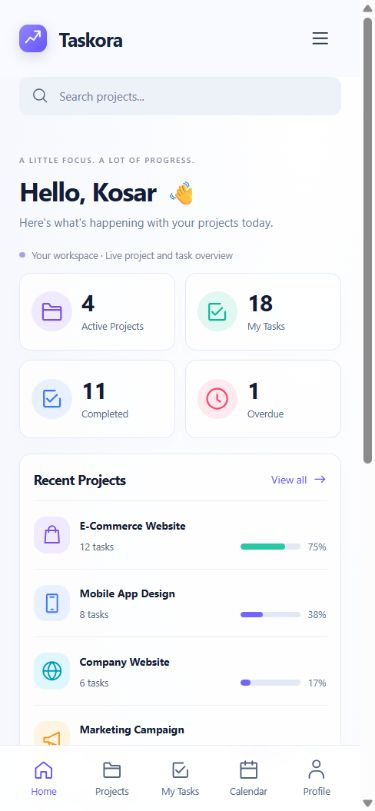

# Taskora

A responsive project and task management demo built with React, TypeScript and Vite.

**Local demo:** no backend, real authentication, cloud sync or team accounts. The welcome screen opens a demo session; it is not an access-control boundary.

## Run locally

Use Node.js 22.12+ (verified with 22.13.1) and npm. The installed Vite package also supports Node 20.19+.

Run from the project directory:

~~~sh
npm ci
npm run dev
~~~

Open the local URL printed by Vite, then choose **Open demo workspace**. No account, API key or environment variables are required.

For an explicit loopback address and port (also works in PowerShell):

~~~sh
node node_modules/vite/bin/vite.js --host 127.0.0.1 --port 5173 --strictPort
~~~

Use the same hostname and port when revisiting the demo: browser storage belongs to that origin. For example, localhost and 127.0.0.1 do not share saved tasks.

## What you can do

- **Dashboard:** project progress, personal task totals and upcoming deadlines.
- **Projects:** search, filter and sort four seeded projects; open their task boards.
- **Tasks:** create, edit, assign, change status, delete and undo the last deletion. Desktop boards support drag-and-drop, with a status menu as the keyboard/mobile alternative.
- **My Tasks:** create tasks across projects and filter personal tasks by project, status, priority and deadline.
- **Calendar:** monthly deadlines, project/owner filters and a daily task list.
- **Reports:** current task summaries and CSV export.
- **Profile:** display name, optional email, headline, bio and avatar color.
- **Settings:** new-task priority, week start, completed-task visibility and card density.
- **Backup:** download tasks as JSON; validate and preview a backup before confirming replacement.

Project creation/editing, real team membership, notifications and authentication are not implemented. Task assignments are local labels. Personal ownership uses a stable demo identity, so changing the profile name does not reassign tasks.

## Routes

| Path | Page |
| --- | --- |
| / | Dashboard |
| /projects | Projects |
| /projects/:projectId | Task board |
| /tasks | My Tasks |
| /calendar | Calendar |
| /reports | Reports |
| /profile | Profile |
| /settings | Settings and backups |
| /login | Demo welcome screen |
| Other paths | 404 |

## Data and persistence

The workspace starts with four projects and 36 sample tasks. Seed deadlines are relative to the date the seed module loads; saved tasks retain their dates.

| Browser storage | Key | Contents |
| --- | --- | --- |
| localStorage | taskora.tasks.v1 | Task snapshot, format version 1 |
| localStorage | taskora.profile.v1 | Profile |
| localStorage | taskora.settings.v1 | Preferences |
| sessionStorage | taskora.demo-session.v1 | Demo entry flag for the tab |

Leaving the demo preserves saved work. Clearing browser data removes local data. Storage failures produce a visible warning; changes may then last only for the current session. Invalid saved task data falls back to sample tasks without overwriting the unreadable snapshot.

Undo restores only the last task deletion while the workspace remains open. Reloading loses that undo history.

### Task backups

In **Settings → Task backup**, download a JSON snapshot before replacing data. Imports accept Taskora version-1 task snapshots up to 2 MiB and validate fields, dates, project IDs and duplicate task IDs.

Selecting a file only opens a preview. **Replace all tasks** replaces the complete task list; it does not merge. An empty backup clears the list. This replacement cannot be reversed with the task Undo button.

Backups contain tasks and assignments, not profile or preferences. Project IDs must belong to the four existing demo projects.

## Commands and checks

| Command | Purpose |
| --- | --- |
| npm run dev | Vite development server |
| npm run build | TypeScript checking and production build in dist |
| npm run preview | Serve the production build locally |
| npm run lint | Oxlint checks |
| npm run test:tasks | 50 model and server-rendering checks |
| npm run check | Run lint, task checks and build sequentially |

The task checks cover CRUD, validation, storage round trips, filtering, calendar dates, reports, backup replacement and rendered routes/forms. They do not simulate a complete browser interaction suite.

Browser findings and screenshots:
- [Task 20: desktop flows and dialog focus](docs/qa/task20.md)
- [Task 21: responsive layout and keyboard navigation](docs/qa/task21.md)

Known verification gaps: CSV/JSON download delivery and actual backup replacement remain unverified end-to-end in the browser. Pointer drag-and-drop, physical mobile devices, screen readers and a full accessibility audit also remain outside completed browser coverage.

## Code map

~~~text
src/
  app/          Router configuration
  components/   Shared task forms, cards, backup UI and layout
    ui/         Button, Input, Icon and native-dialog Modal
  data/         Seed data, selectors, date/report/backup helpers
  pages/        Route pages and their styles
  state/        Context providers, task reducer and storage handling
scripts/
  check-tasks.mjs   Model and SSR checks
  fixtures/        Invalid/empty backup files for preview testing
docs/qa/           Browser QA notes and screenshots
~~~

Task mutations go through the shared reducer and provider. Project counts/progress are derived from tasks. Profile, preferences and demo session use separate providers. UI components share validation and storage behavior instead of keeping separate page copies of task data.

## Production build and publishing

~~~sh
npm run check
npm run preview
~~~

Publish the contents of **dist** to a static host. The application currently assumes deployment at the domain root. Configure the host to serve index.html for client-side routes such as /tasks and /projects/mobile-app; otherwise direct visits and refreshes may return the host's 404.

Vite preview is a local verification server, not a production hosting service. Sites hosting is configured in .openai/hosting.json with dist as the static output. New deployments are private to the owner; hosting access is separate from the app demo session.

Before publishing, complete the remaining browser checks above, verify direct-route refresh on the chosen host, and confirm the demo/local-storage limitations remain clear to visitors.
